# CineNotes MVP Use Cases

## Purpose

This document explains the main actors and use cases for the new CineNotes MVP. It should be used by Codex together with the ERD, SRS, and backend entity documentation.

CineNotes is being redesigned from a simple movie/series review app into a personal movie/series tracker and mood-based recommendation platform. The use cases in this document define what each type of user can do and help guide backend API design, frontend page planning, and security rules.

---

## System Boundary

System name: **CineNotes MVP**

The system includes:

- Public movie/series browsing
- User authentication
- User reviews
- Watchlist tracking
- Watch memory logs
- Mood recording after watching
- Mood-based recommendations
- Admin title, genre, mood tag, and review moderation management
- Audit logging for important actions

The system does not include advanced social features in the MVP, such as followers, review likes, comments, social feeds, direct messaging, or AI-generated recommendations.

---

## Actors

### 1. Guest

A Guest is an unauthenticated visitor. A Guest can browse public content but cannot create personal data.

Guest permissions:

- Browse public titles
- Search, filter, and sort titles
- View title details
- View public reviews
- Register for an account
- Log in

---

### 2. Registered User

A Registered User is an authenticated normal user with the `USER` role. A user can interact with titles and manage their own personal movie/series tracking data.

User permissions:

- Log in and log out
- View and update own profile
- Browse titles
- Search, filter, and sort titles
- View title details
- Write a review
- Edit own review
- Delete own review
- Add title to watchlist
- Update watch status
- Remove title from watchlist
- Mark title as favorite
- Create watch memory log
- Edit own watch memory log
- Delete own watch memory log
- Record mood tags after watching
- View own reviews
- View own watchlist
- View own watch logs
- Get mood-based recommendations

---

### 3. Admin

An Admin is an authenticated user with the `ADMIN` role. Admins manage the platform data and moderate user-generated content.

Admin permissions:

- Log in and log out
- Access admin dashboard
- Manage imported TMDb title data
- Create, update, and delete title records when necessary
- Manage genres
- Manage mood tags
- Assign genres to titles
- Assign mood tags to titles
- Moderate reviews
- Hide or delete inappropriate reviews
- View audit logs
- Manage users in a future version

---

## Main Use Cases

| Use Case ID | Use Case Name | Actor(s) | Description | MVP Priority |
|---|---|---|---|---|
| UC-001 | Register Account | Guest | Guest creates a new CineNotes account. | High |
| UC-002 | Log In | Guest, User, Admin | Actor logs into the system using credentials. | High |
| UC-003 | Browse Titles | Guest, User, Admin | Actor views available movie/series titles. | High |
| UC-004 | Search and Filter Titles | Guest, User, Admin | Actor searches, filters, and sorts titles by keyword, type, genre, mood, or rating. | High |
| UC-005 | View Title Details | Guest, User, Admin | Actor views title metadata, genres, mood tags, average rating, and public reviews. | High |
| UC-006 | Write Review | User | User writes a review and rating for a title. | High |
| UC-007 | Edit Own Review | User | User edits their own review. | High |
| UC-008 | Delete Own Review | User | User deletes their own review. | Medium |
| UC-009 | Manage Watchlist | User | User adds, updates, favorites, or removes titles from their watchlist. | High |
| UC-010 | Update Watch Status | User | User marks a title as WANT_TO_WATCH, WATCHING, WATCHED, or DROPPED. | High |
| UC-011 | Create Watch Memory Log | User | User records a private memory after watching a title. | High |
| UC-012 | Record Mood After Watching | User | User links mood tags to a watch log. | High |
| UC-013 | View Personal Dashboard | User | User views own watchlist, reviews, logs, and tracking summary. | Medium |
| UC-014 | Get Mood-Based Recommendations | User | User selects mood tags and receives matching title recommendations. | High |
| UC-015 | Manage Titles | Admin | Admin manages title metadata and imported TMDb data. | High |
| UC-016 | Manage Genres | Admin | Admin creates, edits, or deletes genres. | Medium |
| UC-017 | Manage Mood Tags | Admin | Admin creates, edits, or deletes mood tags. | High |
| UC-018 | Assign Genres to Titles | Admin | Admin links genres to titles. | High |
| UC-019 | Assign Mood Tags to Titles | Admin | Admin links mood tags to titles for recommendation logic. | High |
| UC-020 | Moderate Reviews | Admin | Admin hides or deletes inappropriate reviews. | Medium |
| UC-021 | View Audit Logs | Admin | Admin views important system actions. | Medium |

---

## Use Case Diagram in Mermaid

Codex and GitHub can read this Mermaid diagram. If GitHub does not render it in preview, use Mermaid Live Editor or VS Code Mermaid preview extension.

```mermaid
flowchart LR
    Guest[Guest]
    User[Registered User]
    Admin[Admin]

    subgraph CineNotes_MVP[CineNotes MVP]
        UC_Register((Register Account))
        UC_Login((Log In))
        UC_Browse((Browse Titles))
        UC_Search((Search / Filter / Sort Titles))
        UC_TitleDetails((View Title Details))
        UC_ViewReviews((View Public Reviews))

        UC_Profile((Manage Own Profile))
        UC_WriteReview((Write Review))
        UC_EditReview((Edit Own Review))
        UC_DeleteReview((Delete Own Review))
        UC_Watchlist((Manage Watchlist))
        UC_WatchStatus((Update Watch Status))
        UC_WatchLog((Create Watch Memory Log))
        UC_MoodAfterWatching((Record Mood After Watching))
        UC_Recommendations((Get Mood-Based Recommendations))
        UC_Dashboard((View Personal Dashboard))

        UC_AdminDashboard((Access Admin Dashboard))
        UC_ManageTitles((Manage Titles / TMDb Data))
        UC_ManageGenres((Manage Genres))
        UC_ManageMoodTags((Manage Mood Tags))
        UC_AssignGenres((Assign Genres to Titles))
        UC_AssignMoods((Assign Mood Tags to Titles))
        UC_ModerateReviews((Moderate Reviews))
        UC_AuditLogs((View Audit Logs))
    end

    Guest --> UC_Register
    Guest --> UC_Login
    Guest --> UC_Browse
    Guest --> UC_Search
    Guest --> UC_TitleDetails
    Guest --> UC_ViewReviews

    User --> UC_Login
    User --> UC_Browse
    User --> UC_Search
    User --> UC_TitleDetails
    User --> UC_ViewReviews
    User --> UC_Profile
    User --> UC_WriteReview
    User --> UC_EditReview
    User --> UC_DeleteReview
    User --> UC_Watchlist
    User --> UC_WatchStatus
    User --> UC_WatchLog
    User --> UC_MoodAfterWatching
    User --> UC_Recommendations
    User --> UC_Dashboard

    Admin --> UC_Login
    Admin --> UC_AdminDashboard
    Admin --> UC_ManageTitles
    Admin --> UC_ManageGenres
    Admin --> UC_ManageMoodTags
    Admin --> UC_AssignGenres
    Admin --> UC_AssignMoods
    Admin --> UC_ModerateReviews
    Admin --> UC_AuditLogs
```



---

## Core User Flow

The main MVP user flow is:

```text
Register or log in
→ browse/search titles
→ view title details
→ add title to watchlist
→ update watch status
→ write review
→ create watch memory log
→ select mood tags after watching
→ receive mood-based recommendations
```

This flow should be prioritized before advanced social features.

---

## Core Admin Flow

The main admin flow is:

```text
Log in as admin
→ access admin dashboard
→ manage imported title data
→ manage genres
→ manage mood tags
→ assign genres and mood tags to titles
→ moderate reviews
→ view audit logs
```

This flow supports the recommendation system because mood tags must be maintained by admins.

---

## Access Control Rules

### Public Access

The following can be accessed without login:

- Register
- Login
- Browse titles
- Search/filter/sort titles
- View title details
- View public reviews

### USER Access

The following require `USER` or `ADMIN` authentication:

- Write review
- Edit own review
- Delete own review
- Manage own watchlist
- Create own watch logs
- Edit own watch logs
- Delete own watch logs
- Record mood tags after watching
- Get personalized recommendations
- View own dashboard

### ADMIN Access

The following require `ADMIN` role:

- Admin dashboard
- Manage titles
- Import or update TMDb data
- Manage genres
- Manage mood tags
- Assign genres to titles
- Assign mood tags to titles
- Moderate reviews
- View audit logs

---

## MVP Boundary

The following features are intentionally excluded from the first MVP:

- Follow users
- Like reviews
- Comment on reviews
- Social feed
- Direct messaging
- AI-generated recommendation engine
- Episode-level tracking
- Mobile application
- Real-time notifications

These can be added later after the core tracker and mood recommendation system are stable.

---

## Notes for Codex

When updating code, Codex should use these use cases to understand permissions and feature ownership.

Important rules:

1. Do not allow guests to create reviews, watchlist items, or watch logs.
2. Users can only edit or delete their own reviews, watchlist items, and watch logs.
3. Admins can moderate reviews but should not replace normal user ownership rules.
4. Admin-only routes should be protected with role-based authorization.
5. Mood-based recommendation is an MVP core feature, but it should use simple tag matching first.
6. Advanced social features should not be implemented until the MVP is complete.
